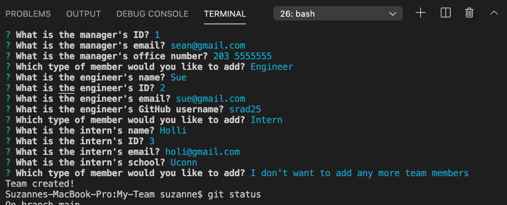
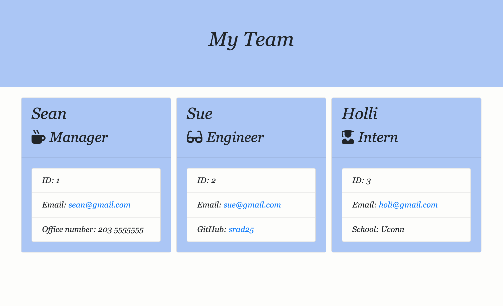
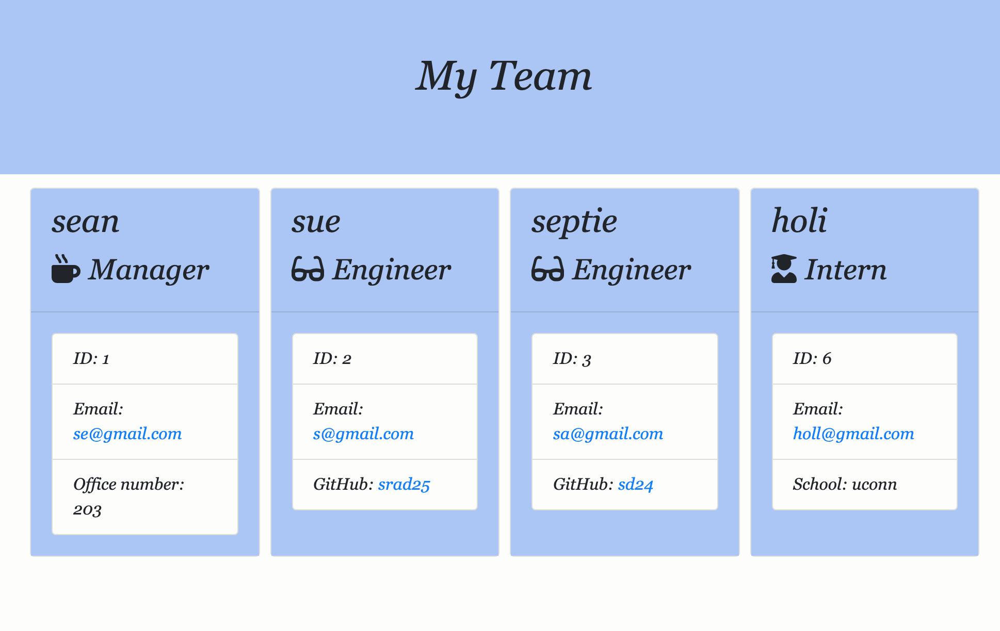

# My-Team

## Objective
Build a Node.js command-line application that takes in information about employees on a software engineering team, then generates an HTML webpage that displays summaries for each person. Testing is key to making code maintainable, so you’ll also write a unit test for every part of your code and ensure that it passes each test.

## Technologies Used
* Node js
* Inquirer
* jest
* path
* HTML
* CSS

## Project Screenshots and Demo

Application being ran in command line. User is prompted to answer a series of questions. At the end of series a Team HTML is  generated.

A preview of the team html opened in browser.

Team can start small

Team can grow by adding new members

#### Link to Demo

[Video](https://drive.google.com/file/d/1YRqROoj_ZBr05_R17vKIpIXQXmLeDFGe/view?usp=sharing)

## Contact
* https://github.com/srad25
* https://github.com/srad25/My-Team